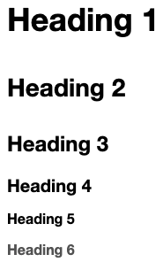

# MarkDown

1. [Heading](#heading)
2. [Emphasis](#emphasis)
3. [Blockquote](#blockquote)
4. [Lists](#lists)
5. [Code](#code)
6. [Horizontal Rules](#horizontal-rules)
7. [Links](#links)
8. [Images](#images)
9. [Escaping Characters](#escaping-characters)
10. [Tables](#tables)
11. [Footnotes](#footnotes)
12. [Definition Lists](#definition-lists)
13. [Task Lists](#task-lists)
14. [Emoji Shortcodes](#emoji-shortcodes)
15. [Highlight](#highlight)
16. [Subscript](#subscript)
17. [Superscript](#superscript)
18. [Underline](#underline)
19. [Center](#center)
20. [Color](#color)
21. [Comments](#comments)
22. [Amonitions](#admonitions)

---

## Heading

```markdown
# Heading 1
## Heading 2
### Heading 3
#### Heading 4
##### Heading 5
###### Heading 6
```



---

## Emphasis

### Bold

```markdown
**This is a bold text**
```

**This is a bold text**

### Italic

```markdown
*This is an italic text*
```

*This is an italic text*

### Bold and Italic

```markdown
***This is a bold/italic text***
```

***This is a bold/italic text***

---

## Blockquote

To create a blockquote, add a > in front of a paragraph.

```markdown
> Dorothy followed her through many of the beautiful rooms in her castle.
```

> Dorothy followed her through many of the beautiful rooms in her castle.

### Blockquotes with Multiple Paragraphs

Blockquotes can contain multiple paragraphs. Add a > on the blank lines between the paragraphs.

```markdown
> Dorothy followed her through many of the beautiful rooms in her castle.
>
> The Witch bade her clean the pots and kettles and sweep the floor and keep the fire fed with wood.
```

> Dorothy followed her through many of the beautiful rooms in her castle.
>
> The Witch bade her clean the pots and kettles and sweep the floor and keep the fire fed with wood.

### Neested Blockquotes

Blockquotes can be nested. Add a >> in front of the paragraph you want to nest.

```markdown
> Dorothy followed her through many of the beautiful rooms in her castle.
>
>> The Witch bade her clean the pots and kettles and sweep the floor and keep the fire fed with wood.
```

> Dorothy followed her through many of the beautiful rooms in her castle.
>
>> The Witch bade her clean the pots and kettles and sweep the floor and keep the fire fed with wood.

### Blockquotes with Other Elements

Blockquotes can contain other Markdown formatted elements. Not all elements can be used — you’ll need to experiment to see which ones work.

```markdown
> #### The quarterly results look great!
>
> - Revenue was off the chart.
> - Profits were higher than ever.
>
>  *Everything* is going according to **plan**.
```

> #### The quarterly results look great!
>
> - Revenue was off the chart.
> - Profits were higher than ever.
>
>  *Everything* is going according to **plan**.

---

## Lists

You can organize items into ordered and unordered lists.

### Ordered Lists

To create an ordered list, add line items with numbers followed by periods. The numbers don’t have to be in numerical order, but the list should start with the number one.

```markdown
1. Second item
2. Third item
3. Fourth item
4. First item

5. First item
6. Second item
7. Third item
8. Fourth item

9. First item
10. Second item
11. Third item
12. Fourth item
```

1. First item
2. Second item
3. Third item
4. Fourth item

```markdown
1. First item
2. Second item
3. Third item
    1. Indented item
    2. Indented item
4. Fourth item
```

1. First item
2. Second item
3. Third item
    1. Indented item
    2. Indented item
4. Fourth item

### Unordered Lists

To create an unordered list, add dashes (-), asterisks (*), or plus signs (+) in front of line items. Indent one or more items to create a nested list.

```markdown
- First item
- Second item
- Third item
- Fourth item

* First item
* Second item
* Third item
* Fourth item

+ First item
+ Second item
+ Third item
+ Fourth item
```

- First item
- Second item
- Third item
- Fourth item

```markdown
- First item
- Second item
- Third item
    - Indented item
    - Indented item
- Fourth item
```

- First item
- Second item
- Third item
    - Indented item
    - Indented item
- Fourth item

### Starting Unordered List Items With Numbers

If you need to start an unordered list item with a number followed by a period, you can use a backslash ( \ ) to escape the period.

```markdown
- 1968\. A great year!
- I think 1969 was second best.
```

- 1968\. A great year!
- I think 1969 was second best.

### Adding Elements in Lists

To add another element in a list while preserving the continuity of the list, indent the element four spaces or one tab, as shown in the following examples.

#### Paragraphs

```markdown
* This is the first list item.
* Here's the second list item.

    I need to add another paragraph below the second list item.

* And here's the third list item.
```

* This is the first list item.
* Here's the second list item.

    I need to add another paragraph below the second list item.

* And here's the third list item.

#### Blockquotes

```markdown
* This is the first list item.
* Here's the second list item.

    > A blockquote would look great below the second list item.

* And here's the third list item.
```

* This is the first list item.
* Here's the second list item.

    > A blockquote would look great below the second list item.

* And here's the third list item.

#### Code Blocks

Code blocks are normally indented four spaces or one tab. When they’re in a list, indent them eight spaces or two tabs.

```markdown
1. Open the file.
2. Find the following code block on line 21:

    `// ... some swift code`

3. Update the title to match the name of your website.
```

1. Open the file.
2. Find the following code block on line 21:

    `// ... some swift code`

3. Update the title to match the name of your website.

#### Images

```markdown
1. Open the file containing the Linux mascot.
2. Marvel at its beauty.

    

3. Close the file.
```

1. Open the file containing the Linux mascot.
2. Marvel at its beauty.

    

3. Close the file.

#### Lists

You can nest an unordered list in an ordered list, or vice versa.

```markdown
1. First item
2. Second item
3. Third item
    - Indented item
    - Indented item
4. Fourth item
```

1. First item
2. Second item
3. Third item
    - Indented item
    - Indented item
4. Fourth item

---

## Code

To denote a word or phrase as code, enclose it in backticks ( ` ).

```markup
At the command prompt, type `nano`.
```

At the command prompt, type `nano`.

### Escaping Backticks

If the word or phrase you want to denote as code includes one or more backticks, you can escape it by enclosing the word or phrase in double backticks (``).

```markdown
``Use `code` in your Markdown file.``
```

``Use `code` in your Markdown file.``

## Horizontal Rules

To create a horizontal rule, use three or more asterisks (***), dashes (---), or underscores (___) on a line by themselves.

```markdown
***
---
___
```

***
---
___

## Links

To create a link, enclose the link text in brackets (e.g., [Duck Duck Go]) and then follow it immediately with the URL in parentheses (e.g., (https://duckduckgo.com)).

```markdown
My favorite search engine is [Duck Duck Go](https://duckduckgo.com).
```

My favorite search engine is [Duck Duck Go](https://duckduckgo.com).

### Adding Titles

You can optionally add a title for a link. This will appear as a tooltip when the user hovers over the link. To add a title, enclose it in quotation marks after the URL.

```markdown
My favorite search engine is [Duck Duck Go](https://duckduckgo.com "The best search engine for privacy").
```

My favorite search engine is [Duck Duck Go](https://duckduckgo.com "The best search engine for privacy").

### URLs and Email Addresses

To quickly turn a URL or email address into a link, enclose it in angle brackets.

```markdown
<https://www.markdownguide.org>
<fake@example.com>
```

<https://www.markdownguide.org>
<fake@example.com>

### Formatting Links

To emphasize links, add asterisks before and after the brackets and parentheses. To denote links as code, add backticks in the brackets.

```markdown
I love supporting the **[EFF](https://eff.org)**.
This is the *[Markdown Guide](https://www.markdownguide.org)*.
See the section on [`code`](#code).
```

I love supporting the **[EFF](https://eff.org)**.
This is the *[Markdown Guide](https://www.markdownguide.org)*.
See the section on [`code`](#code).

---

## Images

To add an image, add an exclamation mark (!), followed by alt text in brackets, and the path or URL to the image asset in parentheses. You can optionally add a title in quotation marks after the path or URL.

```markdown

```


### Linking Images

To add a link to an image, enclose the Markdown for the image in brackets, and then add the link in parentheses.

```markdown
[](https://www.flickr.com/photos/beaurogers/31833779864/in/photolist-Qv3rFw-34mt9F-a9Cmfy-5Ha3Zi-9msKdv-o3hgjr-hWpUte-4WMsJ1-KUQ8N-deshUb-vssBD-6CQci6-8AFCiD-zsJWT-nNfsgB-dPDwZJ-bn9JGn-5HtSXY-6CUhAL-a4UTXB-ugPum-KUPSo-fBLNm-6CUmpy-4WMsc9-8a7D3T-83KJev-6CQ2bK-nNusHJ-a78rQH-nw3NvT-7aq2qf-8wwBso-3nNceh-ugSKP-4mh4kh-bbeeqH-a7biME-q3PtTf-brFpgb-cg38zw-bXMZc-nJPELD-f58Lmo-bXMYG-bz8AAi-bxNtNT-bXMYi-bXMY6-bXMYv)
```

[](https://www.flickr.com/photos/beaurogers/31833779864/in/photolist-Qv3rFw-34mt9F-a9Cmfy-5Ha3Zi-9msKdv-o3hgjr-hWpUte-4WMsJ1-KUQ8N-deshUb-vssBD-6CQci6-8AFCiD-zsJWT-nNfsgB-dPDwZJ-bn9JGn-5HtSXY-6CUhAL-a4UTXB-ugPum-KUPSo-fBLNm-6CUmpy-4WMsc9-8a7D3T-83KJev-6CQ2bK-nNusHJ-a78rQH-nw3NvT-7aq2qf-8wwBso-3nNceh-ugSKP-4mh4kh-bbeeqH-a7biME-q3PtTf-brFpgb-cg38zw-bXMZc-nJPELD-f58Lmo-bXMYG-bz8AAi-bxNtNT-bXMYi-bXMY6-bXMYv)

---

## Escaping Characters

To display a literal character that would otherwise be used to format text in a Markdown document, add a backslash ( \ ) in front of the character.

```markdown
\* Without the backslash, this would be a bullet in an unordered list.
```

\* Without the backslash, this would be a bullet in an unordered list.

### Characters You Can Escape

You can use a backslash to escape the following characters.

| Character | Name |
|-----------|------|
| \ | backslash |
| ` | backtick |
| * | asterisk |
| _ | underscore |
| {} | curly braces |
| [] | brackets |
| <> | angle brackets |
| () | parentheses |
| # | pound sign |
| + | plus sign |
| - | minus sign (hyphen) |
| . | dot |
| ! | exclamation mark |
| \| | pipe |

---

## Tables

> :warning: **Warning:** Tables are part of the Markdown Extended Syntax.

To add a table, use three or more hyphens (---) to create each column’s header, and use pipes (|) to separate each column. For compatibility, you should also add a pipe on either end of the row.

```markdown
| Syntax      | Description |
| ----------- | ----------- |
| Header      | Title       |
| Paragraph   | Text        |
```

| Syntax      | Description |
| ----------- | ----------- |
| Header      | Title       |
| Paragraph   | Text        |

### Alignment

You can align text in the columns to the left, right, or center by adding a colon (:) to the left, right, or on both side of the hyphens within the header row.

```markdown
| Syntax      | Description | Test Text     |
| :---        |    :----:   |          ---: |
| Header      | Title       | Here's this   |
| Paragraph   | Text        | And more      |
```

| Syntax      | Description | Test Text     |
| :---        |    :----:   |          ---: |
| Header      | Title       | Here's this   |
| Paragraph   | Text        | And more      |

### Formatting Text in Tables

You can format the text within tables. For example, you can add links, code (words or phrases in backticks (`) only, not code blocks), and emphasis.

You can’t use headings, blockquotes, lists, horizontal rules, images, or most HTML tags.

### Escaping Pipe Characters in Tables

You can display a pipe (|) character in a table by using its HTML character code (&#124;).

---

## Footnotes

> :warning: **Warning:** Footnotes are part of the Markdown Extended Syntax.

Footnotes allow you to add notes and references without cluttering the body of the document. When you create a footnote, a superscript number with a link appears where you added the footnote reference. Readers can click the link to jump to the content of the footnote at the bottom of the page.

To create a footnote reference, add a caret and an identifier inside brackets ([^1]). Identifiers can be numbers or words, but they can’t contain spaces or tabs. Identifiers only correlate the footnote reference with the footnote itself — in the output, footnotes are numbered sequentially.

Add the footnote using another caret and number inside brackets with a colon and text ([^1]: My footnote.). You don’t have to put footnotes at the end of the document. You can put them anywhere except inside other elements like lists, block quotes, and tables.

```markdown
Here's a simple footnote,[^1] and here's a longer one.[^bignote]

[^1]: This is the first footnote.

[^bignote]: Here's one with multiple paragraphs and code.

    Indent paragraphs to include them in the footnote.

    `{ my code }`

    Add as many paragraphs as you like.
```

Here's a simple footnote,[^1] and here's a longer one.[^bignote]

[^1]: This is the first footnote.

[^bignote]: Here's one with multiple paragraphs and code.

    Indent paragraphs to include them in the footnote.

    `{ my code }`

    Add as many paragraphs as you like.

---

## Definition Lists

> :warning: **Warning:** Definition Lists are part of the Markdown Extended Syntax.

Some Markdown processors allow you to create definition lists of terms and their corresponding definitions. To create a definition list, type the term on the first line. On the next line, type a colon followed by a space and the definition.

First Term
: This is the definition of the first term.

Second Term
: This is one definition of the second term.
: This is another definition of the second term.

---

## Task Lists

> :warning: **Warning:** Task Lists are part of the Markdown Extended Syntax.

Task lists (also referred to as checklists and todo lists) allow you to create a list of items with checkboxes. In Markdown applications that support task lists, checkboxes will be displayed next to the content. To create a task list, add dashes (-) and brackets with a space ([ ]) in front of task list items. To select a checkbox, add an x in between the brackets ([x]).

```markdown
- [x] Write the press release
- [ ] Update the website
- [ ] Contact the media
```

- [x] Write the press release
- [ ] Update the website
- [ ] Contact the media

---

## Emoji Shortcodes

> :warning: **Warning:** Emoji Shortcodes are part of the Markdown Extended Syntax.

Some Markdown applications allow you to insert emoji by typing emoji shortcodes. These begin and end with a colon and include the name of an emoji.

```markdown
Gone camping! :tent: Be back soon.

That is so funny! :joy:
```

Gone camping! :tent: Be back soon.

That is so funny! :joy:

---

## Highlight

> :warning: **Warning:** Highlight is part of the Markdown Extended Syntax.

This isn’t common, but some Markdown processors allow you to highlight text. The result looks like this. To highlight words, use two equal signs (==) before and after the words.

I need to highlight these ==very important words==.

---

## Subscript

> :warning: **Warning:** Subscript is part of the Markdown Extended Syntax.

This isn’t common, but some Markdown processors allow you to use subscript to position one or more characters slightly below the normal line of type. To create a subscript, use one tilde symbol (~) before and after the characters.

```markdown
H~2~O
```

H~2~O

--- 

## Superscript

> :warning: **Warning:** Superscript is part of the Markdown Extended Syntax.

This isn’t common, but some Markdown processors allow you to use superscript to position one or more characters slightly above the normal line of type. To create a superscript, use one caret symbol (^) before and after the characters.

```markdown
X^2^
```

X^2^

---

## Underline

Underlined text is not something you typically see in web writing, probably because underlined text is nearly synonymous with links. However, if you’re writing a paper or a report, you may need the ability to underline words and phrases. A couple of applications like Bear and Simplenote provide support for underlining text, but Markdown doesn’t natively support underlining. If your Markdown processor supports HTML, you can use the <ins> HTML tag to underline text in your document.

```markdown
Some of these words <ins>will be underlined</ins>.
```

Some of these words <ins>will be underlined</ins>.

---

## Center
Having the ability to center text is a necessity when writing a paper or a report. Unfortunately, Markdown doesn’t have any concept of text alignment (one possible exception is when using tables). The good news is that there’s an HTML tag you can use: `<center>`. If your Markdown processor supports HTML, you can place these tags around whatever text you want to center align.

```markdown
<center>This text is centered.</center>
```

<center>This text is centered.</center>

---

## Color

Markdown doesn’t allow you to change the color of text, but if your Markdown processor supports HTML, you can use the <font> HTML tag. The color attribute allows you to specify the font color using a color’s name or the hexadecimal #RRGGBB code.

```markdown
<font color="red">This text is red!</font>
```

<font color="red">This text is red!</font>

---

## Comments

Some people need the ability to write sentences in their Markdown files that will not appear in the rendered output. These comments are essentially hidden text. The text is viewable by the author of the document, but it’s not printed on the webpage or PDF. Markdown doesn’t natively support comments, but several enterprising individuals have devised a solution.

To add a comment, place text inside brackets followed by a colon, a space, and a pound sign (e.g., [comment]: #). You should put blank lines before and after a comment.

```markdown
Here's a paragraph that will be visible.

[This is a comment that will be hidden.]: # 

And here's another paragraph that's visible.
```

Here's a paragraph that will be visible.

[This is a comment that will be hidden.]: # 

And here's another paragraph that's visible.

---

## Admonitions

Admonitions are frequently used in documentation to call attention to warnings, notes, and tips. Markdown doesn’t provide special syntax for admonitions, and most Markdown applications don’t provide support for admonitions (one exception is MkDocs).

However, if you need to add admonitions, you might be able to use blockquotes with emoji and emphasis to create something that looks similar to the admonitions you see on other websites.

> :warning: **Warning:** Do not push the big red button.

> :memo: **Note:** Sunrises are beautiful.

> :bulb: **Tip:** Remember to appreciate the little things in life.