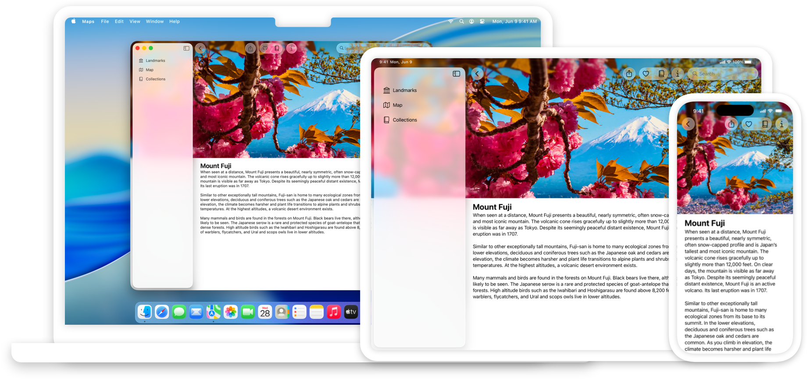
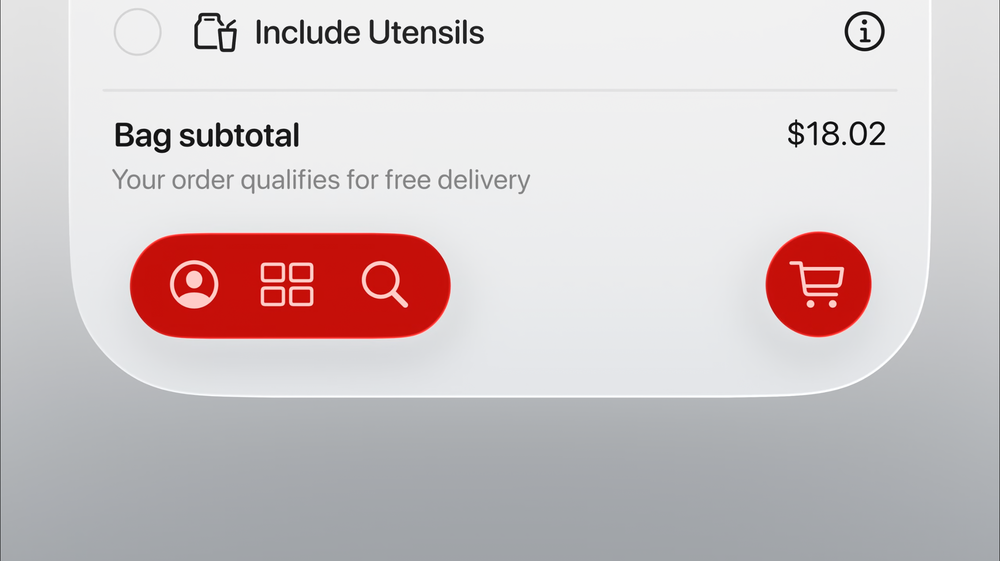
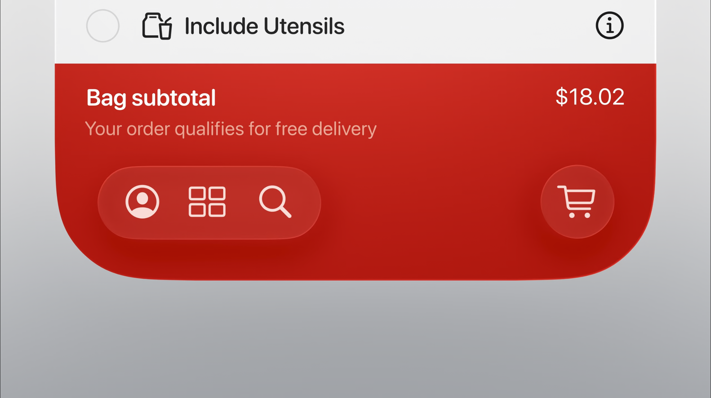
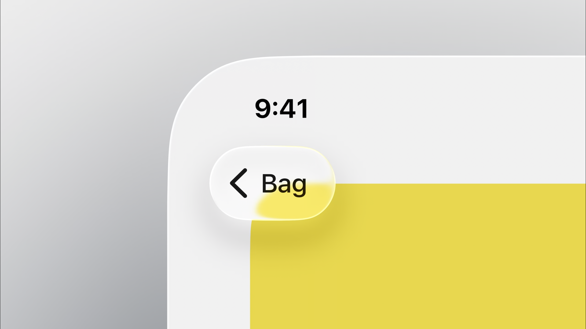
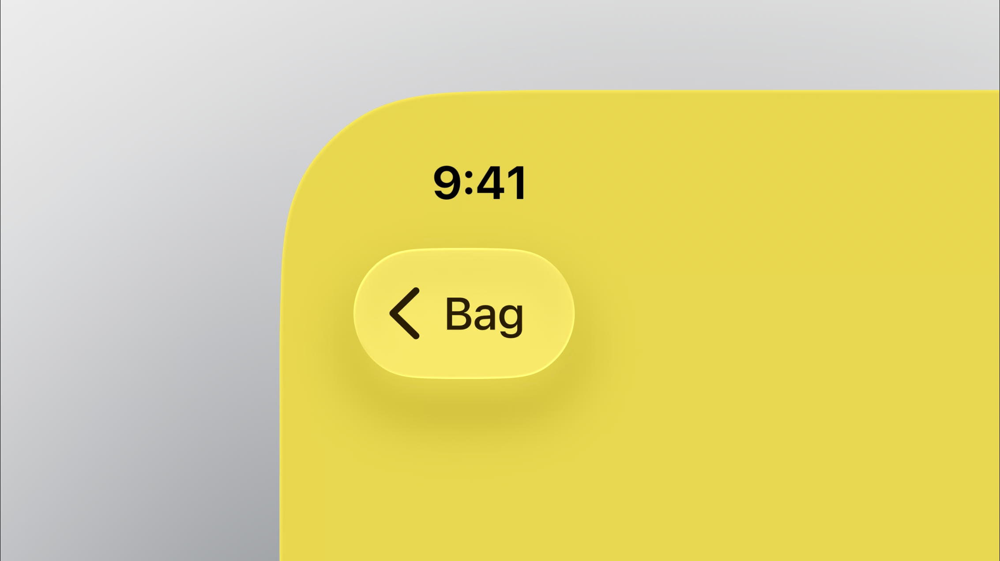

# Liquid Glass

[Apple Developer Documentation - Liquid Glass](https://developer.apple.com/documentation/TechnologyOverviews/liquid-glass)
[WWDC25 - Meet Liquid Glass]()
[WWDC25 - Design with the Liquid Glass desing system]()
[WWDC25 - Build a UIKit app with the new design]()

## When to use

For navigation items, 

## Tinting

Avoid tinting all your elements because when evey element is tinted, nothing stands out, and it can be confusing.

If you want to imbue color into your app, do it in the content layer instead.

> :warning: **Warning:**
>
> Tinting should only be used to bring emphasis to primary elements and actions in the UI.

Avoid intersections between content and Liquid Glass

Instead, reposition or scale the content to mantain separation.

  
  

