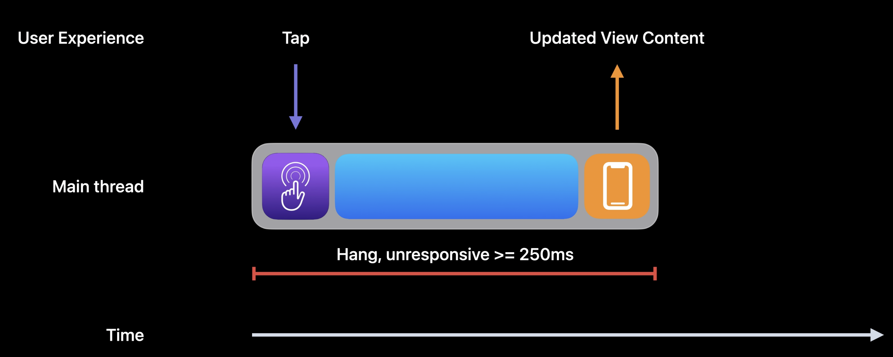
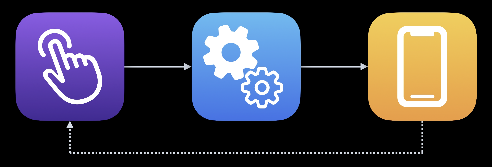

# Hangs

A hang refers to a situation where an app becomes unresponsive, meaning the UI stops updating, and user interactions (like taps and gestures) do not trigger any response. This usually happens when the main thread (UI thread) is blocked for too long.

> ⚠️ **Warning**: A hang causes the main thread is unavailable to process new user interactions until the hang is resolved.

## The Main Runloop

The main runloop is a loop your application's main thread enters to run even handlers in response to incoming events, primarly user interactions.

1. You receive the user interaction.
2. You process the user interaction.
3. You update the app's UI if need.

> ⚠️ **Warning**: This process repeats for each user imput / interaction.

## Hang Causes

### Bussy Main Thread

These tasks prevent the main thread from processing other UI updates or user input, making the app feel sluggish.

**Proactively doing Work**

This happens when the app performs unnecessary tasks **before they are needed**.

**Performing Irrelevant Work**

Executing non-essential tasks on the main thread instead of prioritizing critical UI updates.

**Suboptimal API Ussage**

Using APIs inefficiently can result in excessive work being done on the main thread. Avoid use the wrong API for a job.

### Blocked Main Thread

**Synchronous API Usage**

Blocking the main thread by making synchronous network or database calls.

**File I/O**

Reading or writing large files on the main thread.

**Synchronization**

Blocking the main thread due to improper synchronization, such as waiting for another task to finish.

**Getting An Unvarying Value**

Fetching a value that does not change frequently but doing so synchronously in a way that blocks execution.

## Strategies

### Optimizing work on the Main Thread

1. Minimize UIUpdates
   1. Only update the UI when necessary.
   2. Batch UI updates together to avoid multiple layour passes.
2. Use Efficient Data Structures.
   1. Choose the right data structure based on the use case.
   2. Avoid expensive operations like searching or sorting large datasets directly on the main thread.
3. Lazy Loading.
   1. Load resources only when needed.
   2. Use `lazy` properties to defer initialization until the first use.
4. Optimize Auto Layout
   1. Reduce the complexity of Auto Layout constraints.
   2. Use `isHidden`instead adding / removing views dynamically.
   3. Consider using `UIStackView` for simpler layout management.
5. Use the `Thread Performance Checker` tool at xcode in the `Edit Schme` > `Diagnostics` Configuration

### Movimng Work of the Main Thread

1. Use Grand Central Dispatch (GCD).
   1. Use background queues for heavy computations, network requests, or file I/O.
   2. Use the QoS correctly.
      1. `.userInteractive`: For tasks that require immediate results (e.g., animations).
      2. `.userInitiated`: For tasks initiated by the user that need quick results.
      3. `.utility`: For long-running tasks (e.g., network requests).
      4. `.background`: For tasks that are not time-sensitive (e.g., data syncing).
2. Use `OperationQueue`
   1. `OperationQueue` provides more control over task execution.
   2. You can define dependencies between tasks and cancell them if needed.
3. `async` / `await`.
4. Offload Image Loading
   1. Use libraries like `SDWebImage` or `Kingfisher` to load images asynchronously.
5. Use `Core Data` in the background.
   1. Perform Core Data operations on a background context to avoid blocking the main thread.
   2. Use `perform` or `performAndAwait` to ensure thread safety.