# Instruments

Instruments is a powerful performance analysis and testing tool as part of the Xcode toolset used to understand the behavior and performance of your iOS, macOS, iPadOS, watchOS and vision OS apps.

**First Launch**

From Xcode's product menu, choose the Profile option or use the `command + I` shortcut.

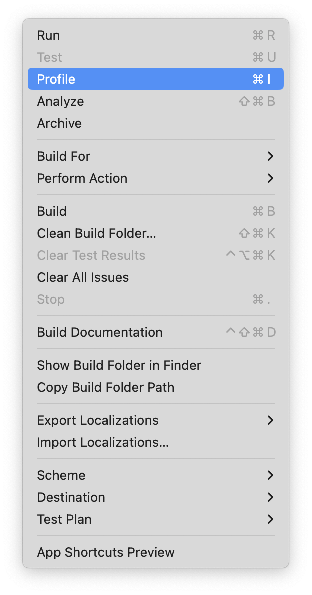

Then you will see a list of templates

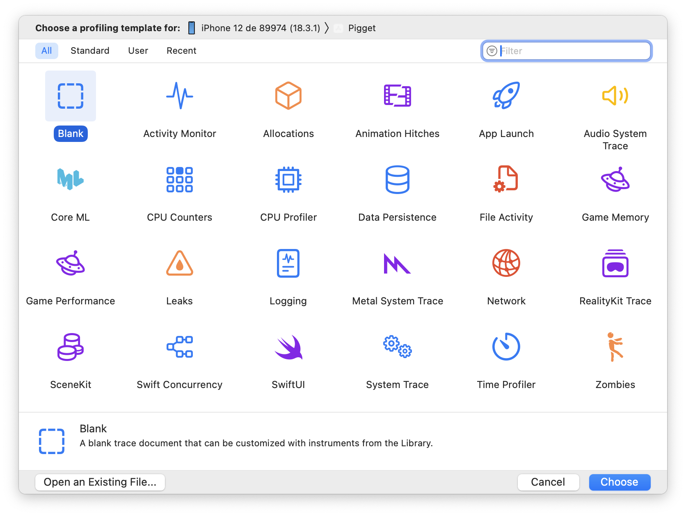

Every template contains a precofigured collection of instruments. Once you have opened the instrumets app an selectected a template for your profiling you will see a new window like this.

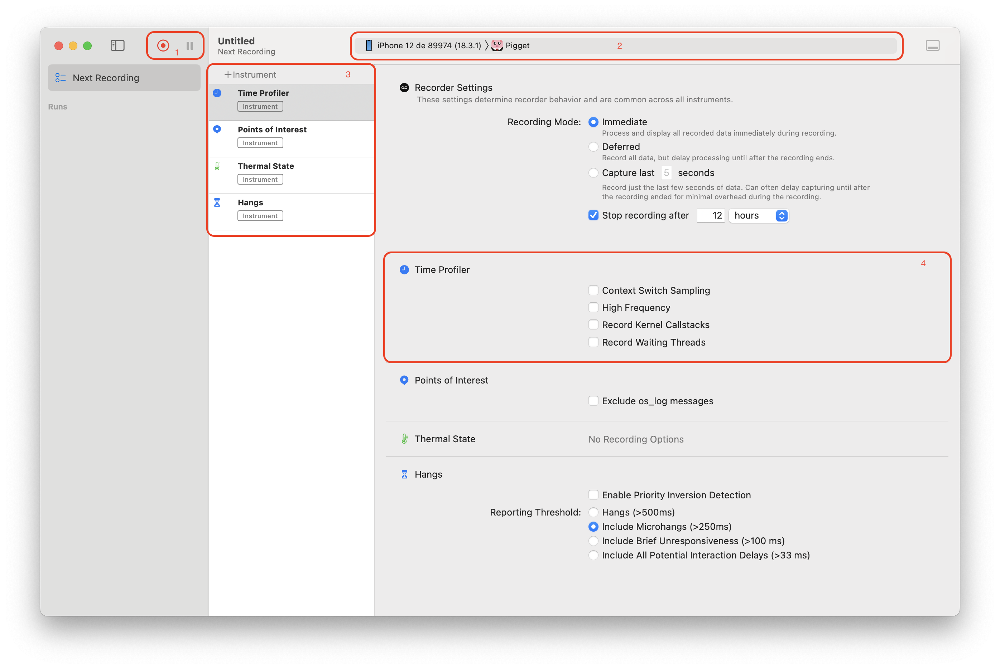

In this window you will find some key sections:

1. The Profiling Controls
2. Your profiling target.
3. The instruments list for your template.
4. The recording options for each instrument. 

At the top of the instruments list you have an `+ Instrument` that you can use to add more instruments to your template.

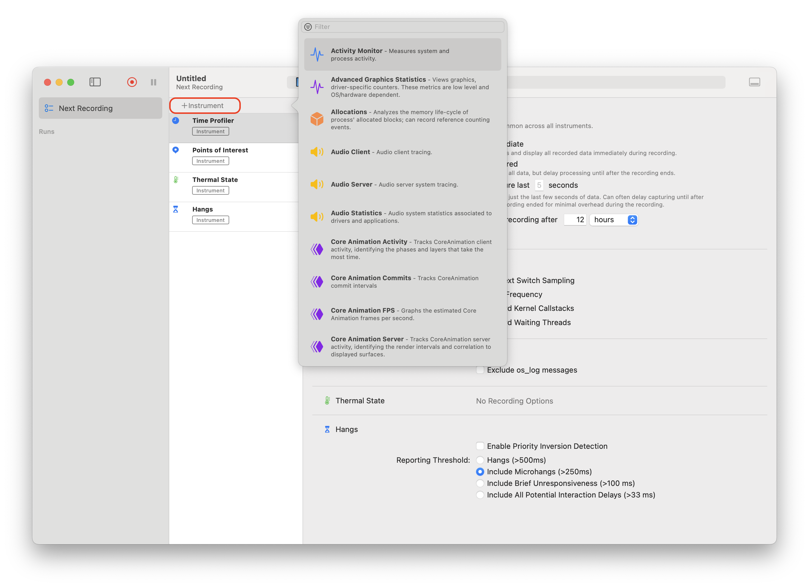

When you start recording your app will be launched an the doccument will be populated with trace data.

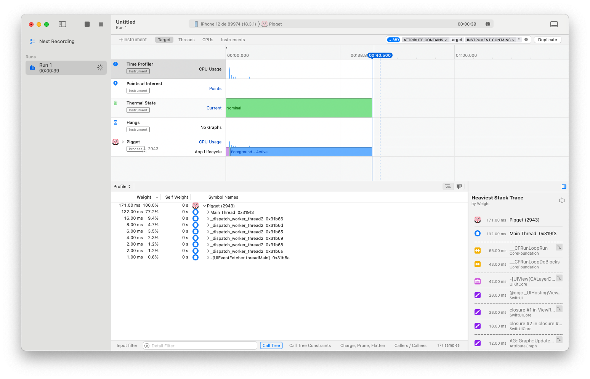

As an aside, recording with Instruments uses system resources, just like your app does. To minimize the impact on your app, Instruments also offers a a feature called *Last Fiew Seconds Mode* / *Windowed*. This mode keeps Instruments from analyzing or displaying until recording ends and ignore events prior to the las few sencods of recording.

When you finish recording you will see some data like this.

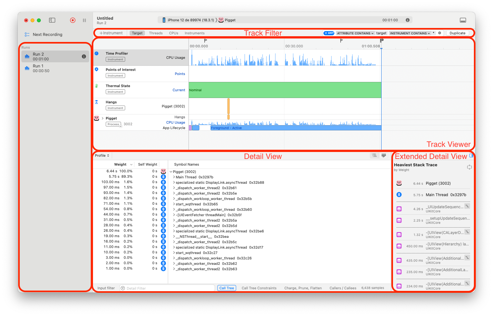

* Track Viewer: A track shows time series trace corresponding to one source of events such as the process, rhread or CPU core. A single Instrument contribute trace data to multiple Traks.
* Track Filter: A given Instrument's trace may have dozens of Tracks, so you can use the Track Filter to just show the Instruments or break it up by thread, or by CPU core.
* Detail View: The Detail View, allows you to explore the trace data of a selected Track.
* Extended Detal View: This view provide richer information from the Instruments in use, depending on current context and selection.

The Instruments app can save and reopen trace files allowing you to export your results or share them with a temmate for investigation.

### Util Features

##### Track Pinning

You can pin some tracks using the plus button that appears on the left-hand side of the track, clicking it pins that track of the botton of the track area allowing you to scroll through the other tracks an see the one that was of interest side by side.

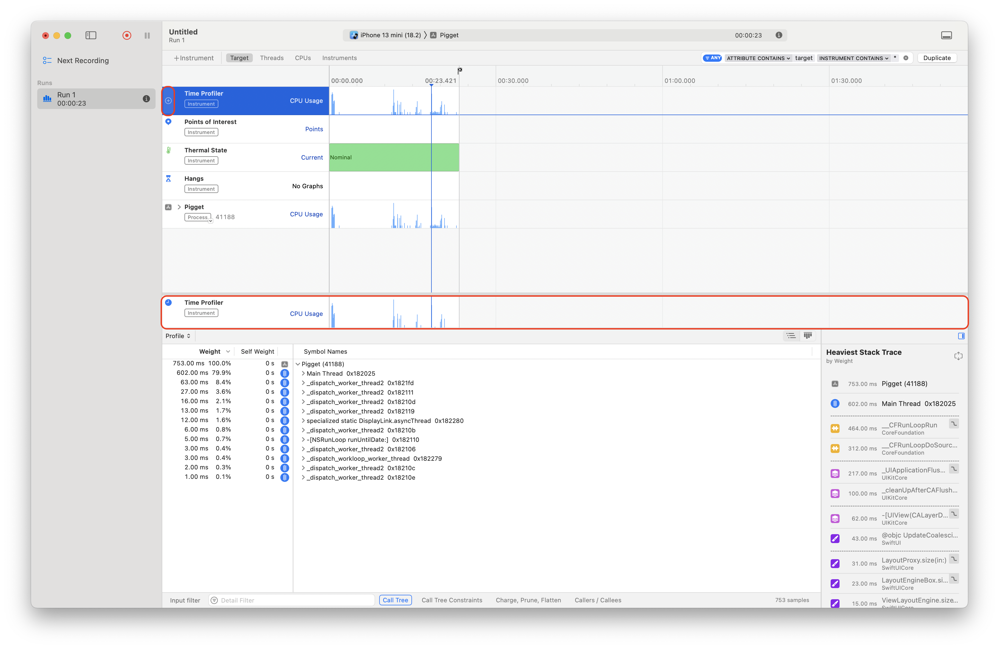

**Tricks**

`Option Key + Click`: To instruments automatically expands the track list until there is a control flox branch.

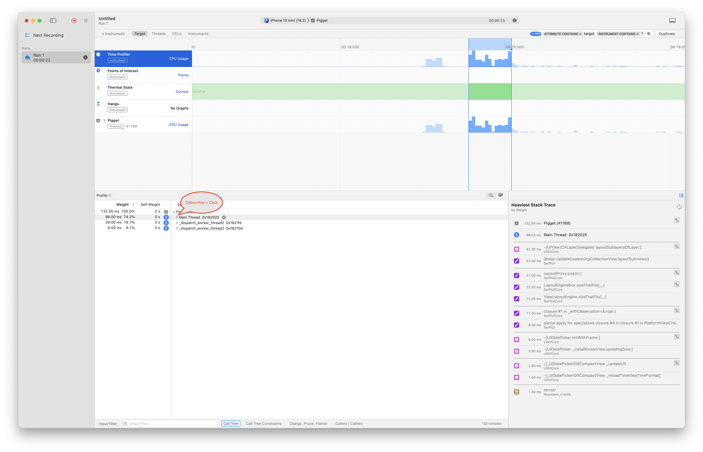

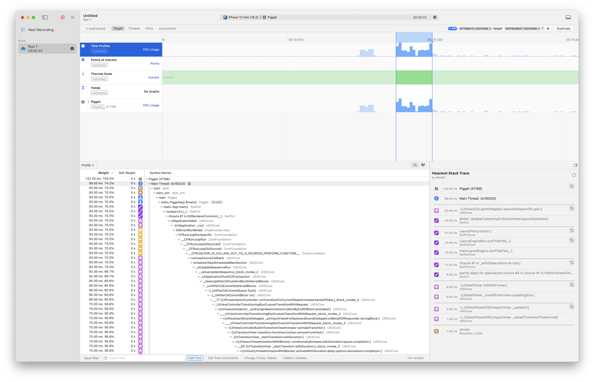

## Time Profiler

This instrument uses infraestructure provided by the operating system to collect call stacks of of relevant threads at a fixed interval.

**Red Spinning Label**: Spinning is how Instruments refers to your main thread being blocked. On the Mac, tha's what causes the Spinning Wait Cursos.

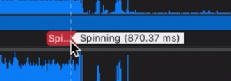

**Heaviest Stack Trace**: Is the set of functions that were called most often during the Profile.

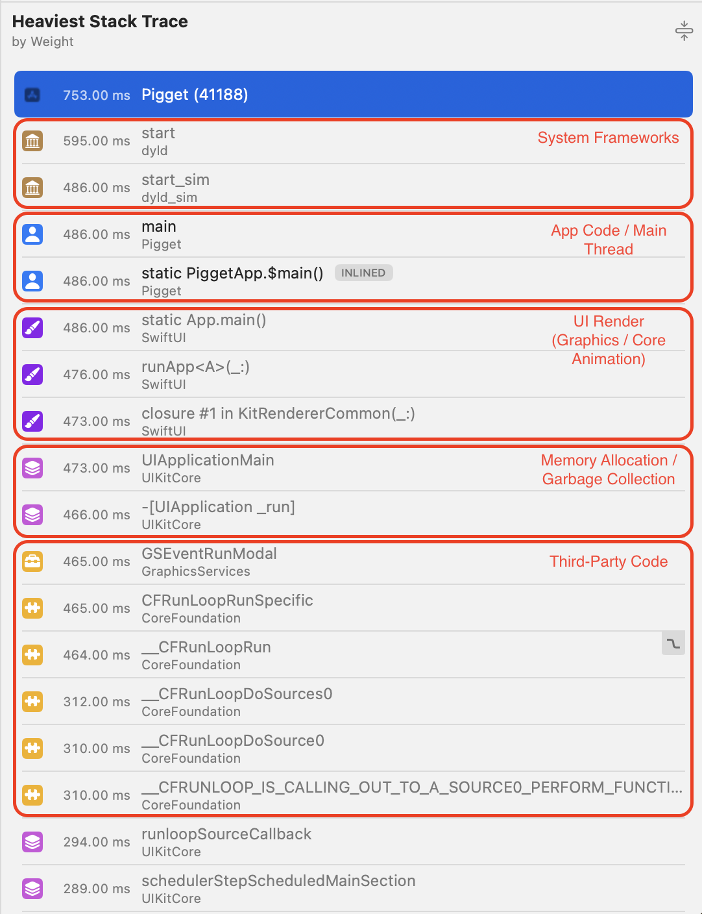

* **Gold (🏛 - Building) → System Frameworks**  
  * Represents calls to Apple's system frameworks, such as UIKit, Foundation, CoreGraphics, CoreData, etc.  
  * These calls are usually optimized by Apple and difficult to improve directly.  
* **Blue (👤 - Person) → Your Code (App Code / Main Thread)**  
  * Indicates code from your app, generally within your classes, functions, and structures.  
  * This is where you can find potential bottlenecks and optimize.  
* **Yellow (🛠 - Toolbox or Puzzle Piece) → Third-Party Code**  
  * Represents code from third-party frameworks you are using, such as Alamofire, Realm, Firebase, etc.  
  * If a lot of time is spent here, you might want to check if you can optimize the use of these libraries.  
* **Pink (📚 - Stack of Books or Memory) → Memory Management (Memory Allocation / Garbage Collection)**  
  * Indicates calls related to memory management, such as object allocations and deallocations.  
  * If this color appears frequently, you may have memory consumption issues or leaks.  
* **Purple (🎨 - Paintbrush or Graphics) → UI Rendering / Graphics (Graphics / Core Animation)**  
  * Represents calls to Core Animation, Core Graphics, Metal, or SceneKit.  
  * Excessive use here suggests the UI might be performing too many drawing calculations.  
* **Green (🔊 - Sound Wave or Speaker) → Audio Processing**  
  * Indicates calls related to AVFoundation, CoreAudio, AudioToolbox, etc.  
  * High usage here could indicate intensive audio processing, such as decoding or real-time effects.  
* **Red (🔧 - Wrench or Alert) → Synchronization and Threading Issues**  
  * Represents thread locks, `pthread_mutex`, `os_unfair_lock`, or waits in `dispatch_sync`.  
  * If you see many calls here, you might be facing concurrency locks that slow down your app.  
* **Light Blue (🌐 - Network / Wi-Fi or Cables) → Networking**  
  * Indicates calls to `URLSession`, `CFNetwork`, `WebSockets`, etc.  
  * High usage here may suggest network latency or unnecessary network calls on the main thread.  
* **Orange (🗂 - Database or Disk) → I/O and File System (File System / Database Access)**  
  * Represents file read/write operations (`NSFileManager`, `CoreData`, `SQLite`).  
  * Excessive use of this color may indicate inefficient database access or reading heavy files on the main thread.  
* **Gray (⚙️ - Gear) → Compiled C / Assembly Code**  
  * Indicates low-level functions written in C/C++ or assembly.  
  * May appear when using frameworks like Accelerate, Metal, SIMD, etc.  

**Thunk**

A `thunk` is a small piece of code generated by the Swift compiler to facilitate certain operations, such as bridging between Swift and Objective-C, handling generics, or managing protocol conformances. When you see a thunk in a stack trace, it typically represents an intermediate function that the compiler has inserted to handle these tasks.

## Points of Interest

This instrument collects data from important areas of your app that you can highlight using various APIs such as Signpost API explained [here](../../Frameworks/Signposts.md).

## Hangs

A hang refers to a situation where an app becomes unresponsive, meaning the UI stops updating, and user interactions (like taps and gestures) do not trigger any response. This usually happens when the main thread (UI thread) is blocked for too long.

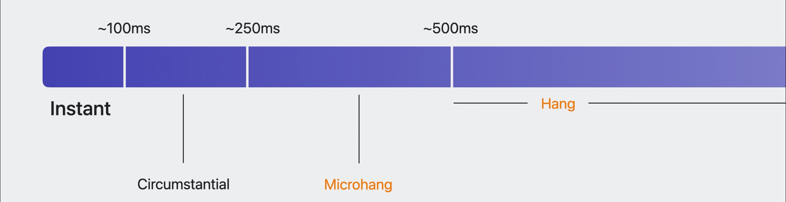

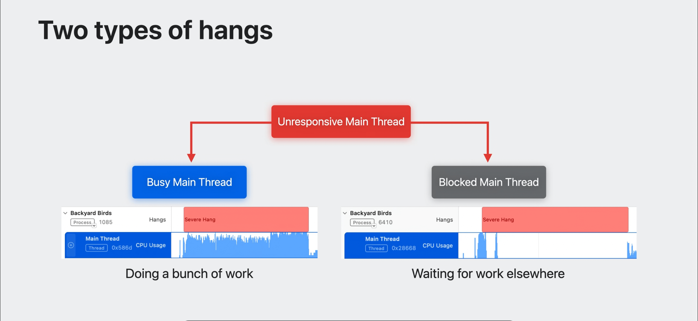

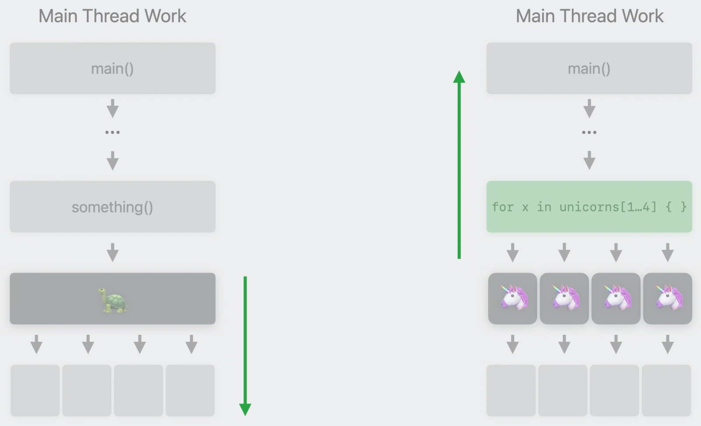

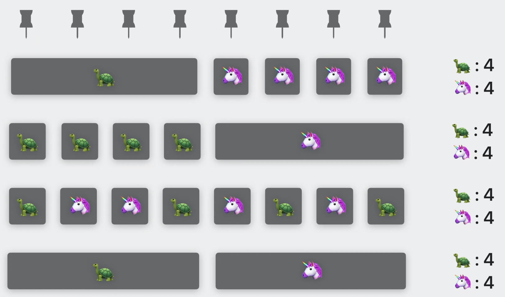

You can check more information about hangs [here](./Hangs/Hangs.md).