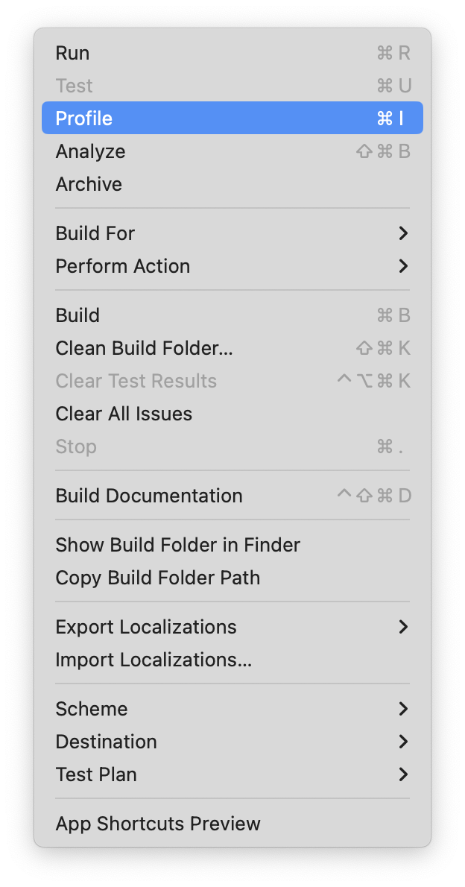
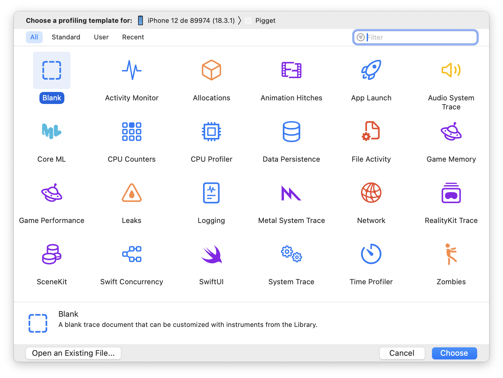
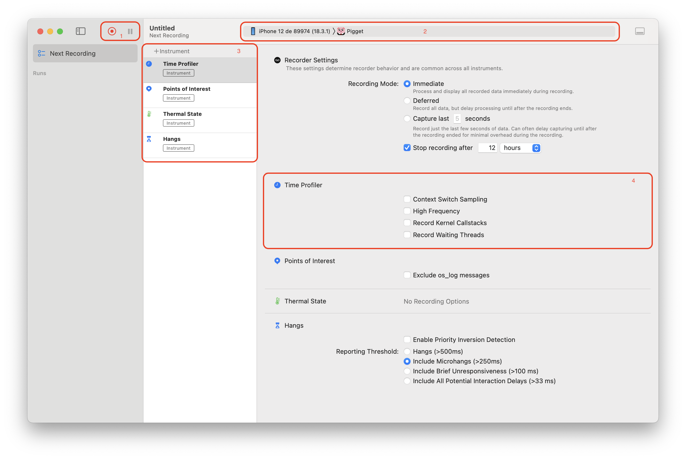
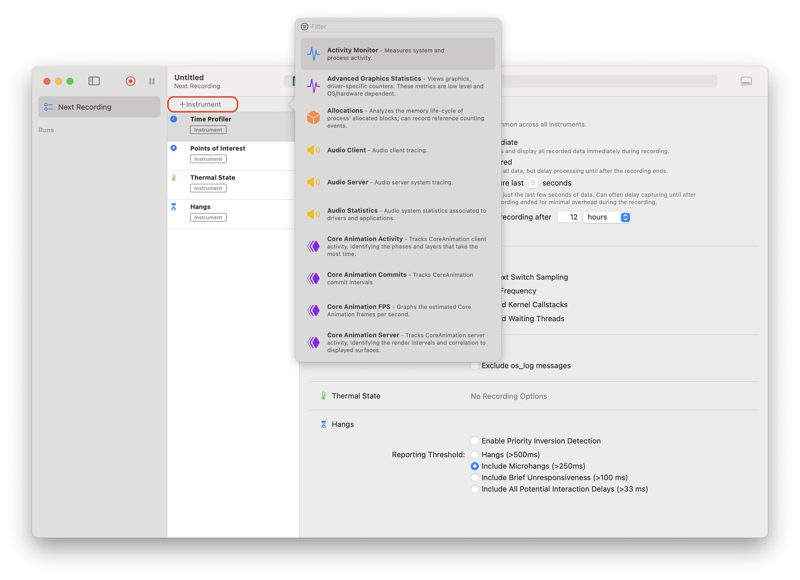
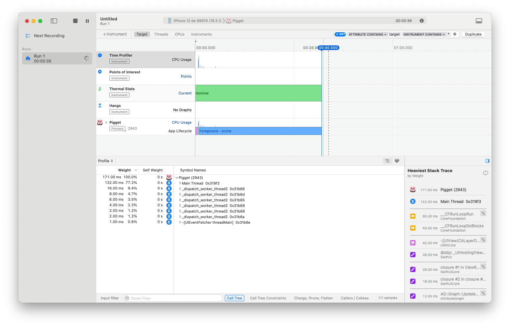
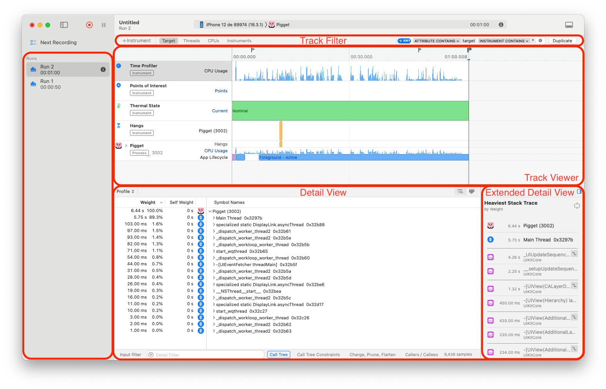

# Instruments

Instruments is a powerful performance analysis and testing tool as part of the Xcode toolset used to understand the behavior and performance of your iOS, macOS, iPadOS, watchOS and vision OS apps.

**First Launch**

From Xcode's product menu, choose the Profile option or use the `command + I` shortcut.

Then you will see a list of templates

Every template contains a precofigured collection of instruments. Once you have opened the instrumets app an selectected a template for your profiling you will see a new window like this.

In this window you will find some key sections:

1. The Profiling Controls
2. Your profiling target.
3. The instruments list for your template.
4. The recording options for each instrument. 

At the top of the instruments list you have an `+ Instrument` that you can use to add more instruments to your template.

When you start recording your app will be launched an the doccument will be populated with trace data.

As an aside, recording with Instruments uses system resources, just like your app does. To minimize the impact on your app, Instruments also offers a a feature called *Last Fiew Seconds Mode* / *Windowed*. This mode keeps Instruments from analyzing or displaying until recording ends and ignore events prior to the las few sencods of recording.

When you finish recording you will see some data like this.

* Track Viewer: A track shows time series trace corresponding to one source of events such as the process, rhread or CPU core. A single Instrument contribute trace data to multiple Traks.
* Track Filter: A given Instrument's trace may have dozens of Tracks, so you can use the Track Filter to just show the Instruments or break it up by thread, or by CPU core.
* Detail View: The Detail View, allows you to explore the trace data of a selected Track.
* Extended Detal View: This view provide richer information from the Instruments in use, depending on current context and selection.

The Instruments app can save and reopen trace files allowing you to export your results or share them with a temmate for investigation.

## Time Profiler

This instrument uses infraestructure provided by the operating system to collect call stacks of of relevant threads at a fixed interval.

## Points of Interest

This instrument collects data from important areas of your app that you can highlight using various APIs such as Signpost API.
